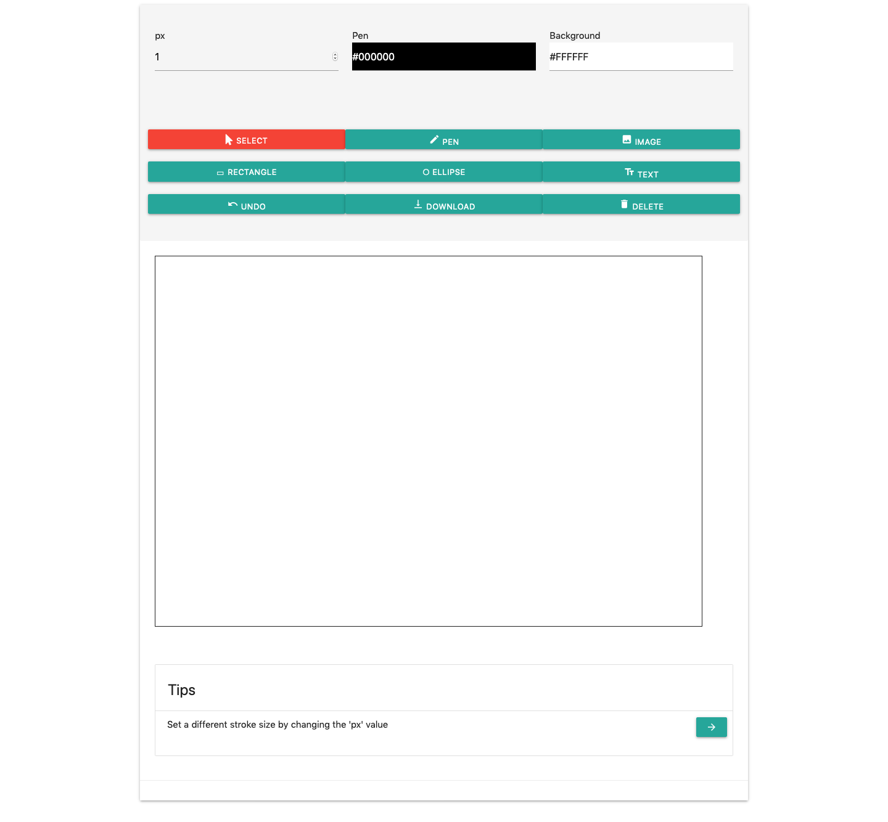
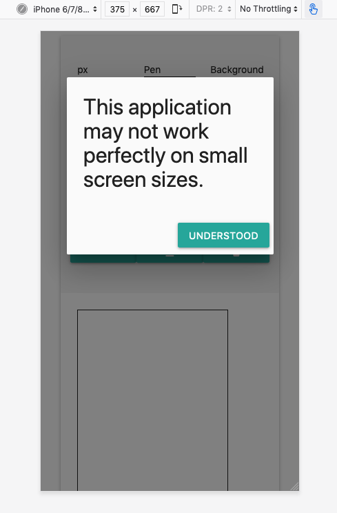
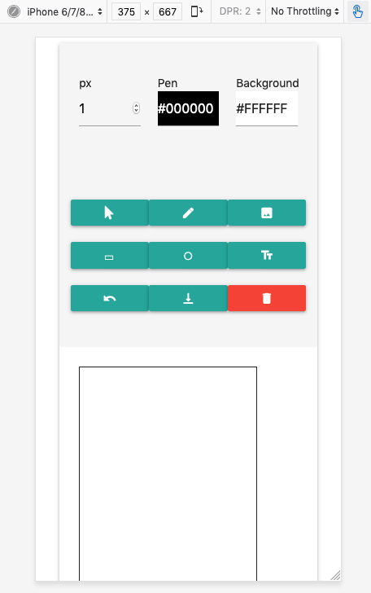

# Sketch

An exploratory project on canvas using Javascript. Try it out at [https://emilyong.github.io/Sketch/](https://emilyong.github.io/Sketch/).

Any sketch is automatically saved to the local storage and is safe from reloads.

## Libraries used
- Huebee: Display color palette
- Materialize: Responsive front-end library

## Platforms

It would be slightly harder to draw using a small screen. A warning would be displayed when the user runs the webpage on a phone.

Despite so, the program handles touch support as well, so you can draw on your screen.

Text is hidden on small screens, displaying only obvious icons.

## Tools
### Select
Select the elements on the canvas, including images, rectangles, ellipses and text, and move them around. You can drag an element out of the canvas to delete that element.
- TODO: Draw bounding box over selected item
- TODO: Selection of drawings is currently unavailable.

### Pen
Set different stroke sizes and pen color to draw.
- By setting a 'rounded' line cap, it allows for smoother drawings.

### Image
Put an image onto the canvas. You can set the width and height beforehand.
- TODO: Resize image after it is drawn

### Rectangle
Drag your mouse across the canvas to draw a rectangle. You can set different color.
- TODO: Show width and height next to the rectangle.

### Ellipse
Drag your mouse across the canvas to draw an ellipse. You can set different color.
- TODO: Show width and height next to the ellipse.
- TODO: Allow drawing of circles using 'Shift' key

### Text
Click onto an area on the canvas. The blinking text cursor shows you where your text would be located. You can set different pen size and color.

### Undo
The undo function currently removes the latest element completely from the canvas.
- TODO: Allow for 'undo' when element changes position

### Download
Opens up a new window. Right click to save the image.

### Delete
Dangerous! Clears the entire canvas.
